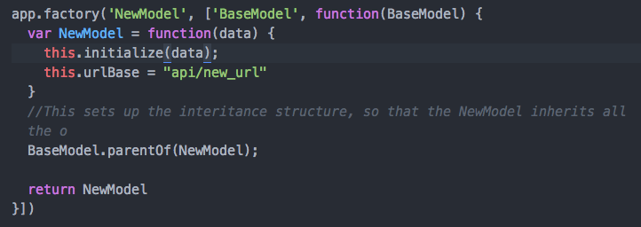
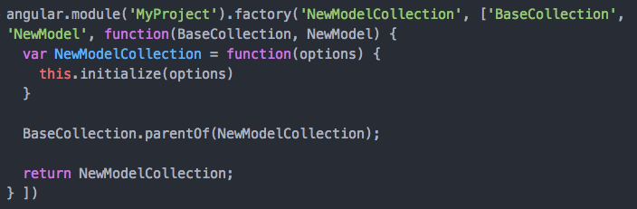
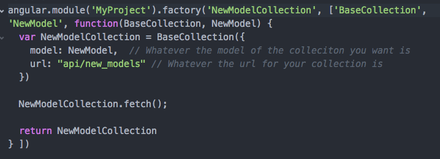

#AngularModelFactory
This is a lightweight model and collection system I created to emulate some of the functionality found in backbone. To keep the system lightweight, no additional frameworks/scripts were included(meaning no underscore.js)

## Setup
To include this in your project, first you need to inject 'AngularModelFactory' into your main project.

## Models
To instantiate a model, simply type the following:

Where NewModel is the name of the model and urlBase is the portion of the url, minus the id.  For non-RESTful API's, the prototype.url() function can be overwritten. It is very important to call this.initialize(data). This is function that parses the data into attributes.  

To bind the attributes to an input, you can't use the get or set methods. Instead, you must directly access the attribute, using _model.attributes.propertyName_

### Methods

+ **BaseModel.parentOf**(class) : Creates an inheritance structure, establishing BaseModel as the parent class of the given class.
+ **initialize**(data) : the initialization function. Takes the data object and calls updateAttributes. Also sets this.\_collections to an empty array. If you overwrite this method, it's recommended you add this line "BaseModel.prototype.updateAttributes.call(this, data)" in order to maintain functionality.
+ **fetch**(options) fetches data, can take success and error callbacks in the options
+ **get**(property) : returns the value set for that property
+ **set**(property, value) : sets the value of property to the given value
+ **isNew**() : returns true if the model lacks an id property
+ **url**() : returns the appropriate url depending on whether or not the model has an id.
+ **save**(options) : attempts to create or update the model in the database depending on the result of the isNew method. Takes an options object with a success callback and an error callback
+ **destroy**(options) : issues a delete request to the url given _url_. If successful, it then removes itself from all collections

## Collections
  A collection represents a set of models. At the moment, each model should have an id attribute, but I'll be working to add cid's next so that won't be for long.

  There are two ways to instantiate a new collection. The first is creating a new subclass of collection, like so
  
  After creating the subclass and calling this.initialize(), you type _BaseCollection.parentOf(subclass)_. This will establish the inheritance structure.

   Unlike a BaseModel, the BaseCollection can be used on it's own, without creating a new subclass. This is because in most basic cases, the only thing that changes between collections is the url and the model attributes. So as long as you don't need to overwrite any existing methods or define new ones, you can do this:
   
   BaseCollection(options) takes an options object, with a url and a model, as well as a comparator and reverse option.

### Methods
+ **BaseCollection.parentOf**(subclass) : Takes a subclass and establishes a prototypical inheritance with BaseCollection being the parent.
+ **fetch**(options) : performs a get request to the collection's url, and then parses the returned data into models by calling _addModels_. Takes an options object, with success and error callbacks. On success, it calls this.add
+ **addModels**(dataArray) : takes a list of data attributes and converts it into model objects, then adds them to the collection
+ **addModel**(data) : takes a single data object and transforms it into the corresponding model, then adds the model to the collection
+ **add**(model) : takes a model and adds it to the collection
+ **find**(id) : takes an id and finds and returns the model with that id. Returns undefined if no model with that id exists.
+ **findIndex**(id) : same as _find_, but returns the index of the given model, or -1 if it's not found.
+ **remove**(id||model) : removes the given model from the collection.
+ **sort**(callback ||) : sorts the model collection, either by the comparator or by the callback. The callback must return 1 , -1, or 0.
+ **each**(callback) : takes a callback, and performs it once for each model, passing the model, the index, and the array in that order. It also uses call to bind the collection as _this_ unless the callback is otherwise bound
+ **where**(callback) : takes a callback that should return either true or false as a parameter and returns a duplicated collection containing only models that returned true.
+ **all**() : returns an array containing all models
+ **first**(n || ) : takes an integer, n, and returns the first n models. If n isn't present, it will just return the first model.
